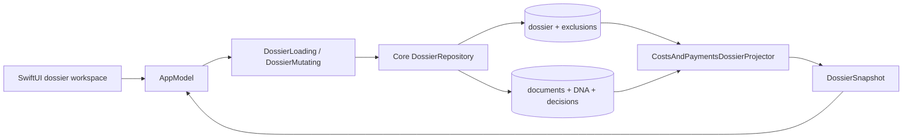

# Anchor-to-Dossier Vertical Slice Design

**Status:** Approved in design review; awaiting written-spec review

**Date:** 2026-09-01

**Scope:** First testable, local, persistent dossier for costs and payments

**Builds on:** the product design dated 2026-08-08, the Document DNA designs
dated 2026-08-24 and 2026-08-25, and the existing invoice-payment matching,
decision, and navigation behavior through pull request 39.

## 1. Objective

This slice lets a user turn an analyzed invoice or payment document into a
persistent dossier named `Kosten und Zahlungen`. The selected document is the
dossier's stable anchor. The dossier explains and displays the anchor's direct
counterparts whose current invoice-payment candidates have a content-valid,
confirmed user decision.

The slice also lets the user remove an inferred member from this one dossier
without changing the underlying invoice-payment decision. That correction
survives path moves, source moves that preserve document identity, content
changes, and later reanalysis until the user resets it.

This is the first Anchor-to-Dossier proof, not a generic graph or context
engine. In this slice, a document anchor means the identity of one whole
catalogued document. It is not a page, text-span, or file bookmark anchor.

## 2. Existing Contracts to Preserve

The implementation builds on these current contracts:

- `LinkLoomCore` owns cataloguing, Document DNA, invoice-payment matching,
  content-bound user decisions, and GRDB persistence.
- `LinkLoomAppFeature` owns `AppModel` and SwiftUI presentation and accesses
  Core behavior through injected protocols.
- `LinkLoomApp` is the composition root and may depend on both targets.
- Invoice-payment candidates are transient projections from current Document
  DNA. They are not persisted.
- A confirmed or excluded invoice-payment decision is bound to the two
  document IDs and their content hashes. It is invisible when either current
  content hash differs.
- Existing source and document selection flows already provide atomic
  cross-source navigation and reject stale, cancelled, failed, and ABA
  completions.
- Selected source documents remain authoritative and must never be renamed,
  moved, deleted, or modified by dossier behavior.

The new feature must preserve local-only processing, balanced security-scoped
access, source-scoped coordination, actor isolation, and the existing
dependency direction. It adds no network call, telemetry, remote
configuration, package dependency, or generated artifact.

## 3. Chosen Approach

Persist dossier identity and dossier-scoped negative corrections. Derive the
current member list atomically from current Document DNA, direct candidates,
content-valid confirmed invoice-payment decisions, and those corrections.

This hybrid keeps user intent durable while leaving rebuildable relationship
evidence derived. It avoids a second materialized-membership invalidation
system and provides the smallest architecture that proves a persistent,
explainable dossier.

Two alternatives are not selected:

1. **Persist every projected membership.** This would require invalidation,
   crash recovery, and reconciliation whenever DNA, content, or a relationship
   decision changes. It duplicates current-state derivation without adding a
   product capability needed by this slice.
2. **Introduce a general entity, graph, and context engine.** That may become
   useful after more relationship types exist, but it would combine entity
   resolution, graph traversal, dossier semantics, and UI in the first review.
   This slice deliberately proves one direct relationship type first.

## 4. Scope

### 4.1 Included

- one persisted dossier type, `costsAndPayments`, displayed as
  `Kosten und Zahlungen`;
- one stable document anchor per dossier;
- idempotent create-or-open resolution;
- direct membership from current, confirmed invoice-payment relationships;
- human-readable membership explanations using current matching signals;
- dossier-scoped removal and restoration of inferred members;
- path-independent persistence through stable document IDs, including source
  moves for which the catalog preserves that identity;
- atomic snapshots across reanalysis and decision changes;
- robust cancellation, loading failure, stale input, duplicate action, and
  ABA handling;
- a Dossiers section, dossier workspace, reusable document inspector, and
  stable accessibility identifiers;
- Core, migration, AppModel, presentation, and process-level UI smoke tests.

### 4.2 Excluded

- transitive relationship traversal;
- generic entities, graph edges, contexts, or arbitrary dossier types;
- manual addition of unrelated documents;
- excluding or replacing the anchor;
- dossier rename, deletion, merge, or subdossiers;
- semantic search, summaries, or external AI;
- page- or text-span anchors;
- changes to candidate scoring or invoice-payment decision semantics.

## 5. Domain Model and Boundaries

### 5.1 Persisted records

`DossierRecord` contains:

- `id: UUID`;
- `kind: DossierKind`, initially only `.costsAndPayments`;
- `displayName: String`, initially `Kosten und Zahlungen`;
- `anchorDocumentID: UUID`;
- `createdAt: Date`;
- `updatedAt: Date`.

`DossierMembershipExclusion` contains:

- `dossierID: UUID`;
- `documentID: UUID`;
- `revisionID: UUID`, replaced whenever the exclusion is created again after
  a reset;
- `excludedAt: Date`.

The exclusion is deliberately not content-bound. It expresses the user's
stable intent that this document does not belong to this dossier, independent
of how the invoice-payment relation is later reanalyzed. `revisionID` gives a
restore command an ABA-safe expected identity.

### 5.2 Projected values

`DossierSnapshot` is the immutable presentation boundary. It contains:

- the dossier record;
- the anchor presentation and availability;
- current inferred members in deterministic order;
- one `DossierMembershipExplanation` per member;
- current exclusions that can be reset;
- a projection token used only as an expected-state precondition.

The anchor explanation is `Ankerdokument`. An inferred member explanation
identifies its invoice or payment role, its counterpart relationship, and the
current matching signals already produced by the invoice-payment resolver.
The support identity includes the content-bound decision key and the relevant
DNA and decision update identities. This makes an old A-state distinguishable
from a newly analyzed A-state after an A-B-A cycle, even when content hashes
return to their earlier values.

### 5.3 Responsibilities

`DossierRepository` in `LinkLoomCore` owns:

- create-or-open resolution;
- persistence of dossier records and exclusions;
- consistent loading of projection input;
- stale-precondition validation for corrections;
- returning complete snapshots, never partial state.

A pure `CostsAndPaymentsDossierProjector` converts one consistent projection
input into a snapshot. It has no database, file, network, clock, or UI
dependency and reuses the current invoice-payment resolver rules rather than
duplicating matching logic.

`LinkLoomAppFeature` sees only focused async protocols:

- `DossierLoading` for listing dossiers, resolving the advisory entry
  disposition, and loading snapshots;
- `DossierMutating` for create-or-open, exclusion, and reset commands.

The executable composition root constructs the Core repository and injects
these capabilities. `LinkLoomCore` gains no app-layer dependency.

## 6. Create-or-Open Semantics

The entry action is available only for an existing document whose current DNA
classifies it as an invoice or payment confirmation.

An advisory read-only lookup returns `.create`, `.open`, or `.choose` so the UI
can use the corresponding label. Its result is never a mutation precondition:
the state may change before the user presses the action.

One repository operation resolves and, when allowed, creates inside one
serialized write transaction:

1. If a dossier of this kind is already anchored by the document, return it.
2. Otherwise, project current memberships for existing dossiers. If the
   document is a current member of exactly one dossier, return that dossier.
3. If it is a current member of more than one dossier, return the matching
   dossier summaries without mutating storage. The app asks the user to choose.
4. If there is no match, insert a new dossier with the document as anchor and
   return its complete snapshot.

A unique constraint on `(kind, anchorDocumentID)` is the final concurrency
guard against duplicate anchors. Different anchors may legitimately create
same-named dossiers for different matters. The multiple-match choice does not
offer implicit creation; creating another dossier from an ambiguous member is
outside this slice.

The app changes workspace selection only after receiving a complete snapshot.
Failure or cancellation leaves the previous workspace unchanged.

## 7. Membership Projection

The anchor is always a visible member while its `document` row exists, even if
its original is missing, its DNA is stale, or its latest analysis failed.

A non-anchor document is a current member only when all of these conditions
hold in the same projection input:

1. the current resolver produces a direct invoice-payment candidate between
   the anchor and that document;
2. the exact relationship key has a current, content-valid `.confirmed` user
   decision;
3. no exclusion exists for `(dossierID, documentID)`.

Projection does not follow relationships from an inferred member. It therefore
cannot add a transitive second-hop document. Results are deduplicated by
document ID and sorted deterministically by source display name, relative
path, and document ID, with the anchor first.

The repository materializes all required rows and DNA values within one GRDB
read or write transaction and runs the pure projection before that transaction
returns. Consumers can therefore never receive DNA from one database state
combined with decisions or corrections from another.

## 8. Corrections and Command Preconditions

Only a currently inferred, non-anchor member can be removed. The command
supplies the dossier ID, document ID, and expected membership support identity
from the displayed snapshot. In one write transaction the repository
reprojects current state and requires an exact match before inserting the
exclusion. A mismatch returns a typed stale-input error and writes nothing.

On success, the repository returns a complete newly projected snapshot. The
underlying `invoicePaymentUserDecision` row is unchanged.

Reset supplies the dossier ID, document ID, and expected exclusion
`revisionID`. The repository deletes only that exact current correction and
returns a new snapshot. The document reappears only if a current confirmed
direct relationship still supports it. Resetting an already replaced
correction is rejected as stale rather than deleting the newer user action.

The anchor cannot be excluded. Repeating an identical in-flight command is
suppressed in `AppModel`, while repository uniqueness and expected-state
checks remain authoritative.

## 9. Reanalysis and Lifecycle Semantics

- A path change or move between sources that preserves document identity does
  not change the dossier or its exclusions.
- A content change preserves the dossier and anchor but makes old content-bound
  decisions non-current. Unsupported inferred members disappear on the next
  complete projection.
- Returning to the exact earlier content may reactivate its earlier confirmed
  relationship. A dossier exclusion still suppresses that document.
- A missing or temporarily unavailable original remains visible when the
  document row remains. The snapshot marks its availability rather than
  silently dropping it.
- Explicit removal of the anchor's source deletes its document row and
  cascades deletion of the dossier and corrections. If that dossier is
  selected, `AppModel` clears the dossier selection and presents one bounded
  diagnostic.
- Completion of any source analysis run triggers reprojection of an active
  dossier because a direct counterpart may live in another source.

Reprojection publishes one entire snapshot. Cancellation publishes nothing
and is not presented as an error. A loading or projection failure keeps the
last complete snapshot visible and exposes a retryable diagnostic.

`AppModel` guards every load and mutation completion with its request
generation, selected dossier ID, and expected projection or support identity.
This rejects stale completion after source, document, or dossier selection
changes, including A-B-A selection cycles. A late completion can neither
replace the current workspace nor clear a newer error or in-flight state.

## 10. Persistence and Migration

Migration `v7_costs_and_payments_dossiers` is additive and performs no
backfill. Dossiers exist only after an explicit user action.

### 10.1 `dossier`

| Column | Contract |
| --- | --- |
| `id` | text primary key |
| `kind` | non-null text constrained to `costsAndPayments` |
| `displayName` | non-empty text |
| `anchorDocumentID` | FK to `document(id)`, cascade delete |
| `createdAt` | non-null datetime |
| `updatedAt` | non-null datetime |

The table has a unique key on `(kind, anchorDocumentID)` and an index on
`anchorDocumentID`.

### 10.2 `dossierMembershipExclusion`

| Column | Contract |
| --- | --- |
| `dossierID` | FK to `dossier(id)`, cascade delete |
| `documentID` | FK to `document(id)`, cascade delete |
| `revisionID` | non-null UUID text, unique |
| `excludedAt` | non-null datetime |

The primary key is `(dossierID, documentID)`. Repository validation rejects an
attempt to persist an exclusion for the dossier anchor. SQLite cannot express
that cross-table invariant as a local check constraint.

Migration tests upgrade a populated v6 database, verify all prior rows remain
unchanged, and exercise uniqueness, foreign keys, cascades, and checks. Fresh
database migration tests continue to run the entire migration chain.

## 11. Application and UI Design

The top-level sidebar adds a `Dossiers` section without changing existing
source behavior. Source selection continues to show the current scan
dashboard. Dossier selection shows a focused
`CostsAndPaymentsDossierView`.

The existing private Document DNA inspector is extracted into a reusable
AppFeature component. Selecting a dossier member delegates to the existing
source and document presentation flows, including cross-source loading. The
dossier remains the workspace selection, and the existing
`Gegenstück anzeigen` action continues to use its established atomic
navigation behavior.

The document inspector exposes `Dossier erstellen`, `Dossier öffnen`, or
`Dossier auswählen` from the advisory lookup, always with accessibility
identifier `document-dna.costs-dossier`. Pressing it invokes the authoritative
create-or-open operation, which may return a different valid outcome after a
race. An ambiguous result shows a chooser and performs no mutation until a
dossier is selected.

The dossier workspace contains:

- a `Kosten und Zahlungen` header;
- a clearly marked anchor;
- current members with source, relative path, document type, availability,
  role, and concise relationship explanation;
- `Aus Dossier entfernen` for inferred members;
- a `Korrekturen` section containing suppressed documents and
  `Wieder aufnehmen` actions.

Stable accessibility identifiers use these contracts:

| Identifier | Element |
| --- | --- |
| `document-dna.costs-dossier` | create/open entry action |
| `dossier.sidebar` | dossier sidebar section |
| `dossier.row.<UUID>` | dossier row |
| `dossier.workspace` | selected dossier workspace |
| `dossier.member.<UUID>` | current member row |
| `dossier.member.remove.<UUID>` | remove inferred member action |
| `dossier.correction.<UUID>` | current exclusion row |
| `dossier.correction.reset.<UUID>` | reset correction action |
| `dossier.error` | retryable dossier diagnostic |

Dynamic identifiers are stable because they use persisted document or dossier
UUIDs, not row positions or display paths.

## 12. Error Contract

Core uses typed errors at the protocol boundary:

- `invalidAnchor` when the requested document is absent or not currently an
  analyzed invoice or payment;
- `dossierNotFound` after cascade or concurrent removal;
- `staleInput` when an expected projection, support, or exclusion identity no
  longer matches;
- `invalidStoredState` for a violated persisted-domain invariant.

Database and unexpected loading failures are mapped to the existing
privacy-safe user diagnostic boundary. Diagnostics contain no extracted text,
content hashes, bookmark data, or absolute paths.

Create/load failure preserves the current workspace. Correction failure
preserves the displayed member or correction. Cancellation is silent. Retry
always starts a new generation and never reuses a failed task.

## 13. Test Strategy

Behavior changes follow red-green-refactor within each pull request.

### 13.1 Core domain and migration tests

- domain validation and deterministic projection order;
- v6-to-v7 upgrade and fresh migration;
- idempotent create-or-open and unique-anchor enforcement;
- exactly one and multiple existing dossier matches;
- direct confirmed membership and rejection of undecided, excluded,
  content-stale, non-candidate, and transitive relationships;
- explanation content, deduplication, and anchor-first ordering;
- exclusion persistence, reset, anchor rejection, and cascade behavior;
- stale support and stale exclusion revision rejection.

### 13.2 Reanalysis tests

- stable document identity after path and source changes;
- content change invalidating inferred membership;
- exact-content return reactivating confirmation while retaining exclusion;
- missing and unavailable originals remaining visible with status;
- failed or stale DNA removing unsupported inferred members only through one
  complete replacement snapshot;
- a repository loading failure preserving the last complete AppModel snapshot;
- anchor-source removal cascading the dossier;
- a completed different-source run discovering a new direct counterpart;
- A-B-A analysis state rejecting an earlier support identity.

### 13.3 AppModel tests

- creation, opening, single-match reuse, and ambiguous choice;
- selection changes only after a complete snapshot loads;
- member selection reuses source/document loading across same and different
  sources;
- load, remove, and reset cancellation publish no partial change;
- failures preserve the last complete snapshot and expose stable diagnostics;
- duplicate commands are suppressed;
- late results and A-B-A source, document, and dossier selections are ignored;
- a cascaded selected dossier is cleared safely.

### 13.4 Presentation and UI smoke tests

SwiftUI presentation tests cover labels, explanations, availability, disabled
states, and accessibility identifiers. The hermetic process-level UI smoke
fixture confirms this user-visible path:

1. analyze its synthetic invoice and payment;
2. confirm their relationship;
3. create the dossier from the invoice;
4. observe the anchor, payment member, and explanation;
5. select the payment and use the existing counterpart navigation;
6. remove the payment from this dossier;
7. restart and verify the dossier and correction persist;
8. reset the correction and verify the payment returns.

The smoke test continues to compare source-file integrity snapshots before and
after the workflow.

Every production pull request runs focused tests, `swift test`,
`swift build -c release`, `git diff --check`, the staged diff check before
commit, and status inspection. Pull requests that change the visible workflow
also run the process-level UI smoke command documented in `README.md`.

## 14. Pull Request Decomposition

The implementation is split into four dependent pull requests. Each starts
from the then-current `origin/main`, has one reviewable outcome, and leaves the
full suite green. No user-facing partial feature is exposed before the final
pull request.

### PR 1: Persist dossier identity and corrections

Add the Core domain values, v7 migration, migration tests, and an internal
storage boundary for inserting and loading dossier and exclusion records.
Validate structural record invariants, uniqueness, and cascades. Do not expose
the domain-level correction commands before current membership can be
validated, and do not add projection, AppModel, composition-root wiring, or UI.

### PR 2: Project current explainable membership

Add the consistent projection-input read, pure direct-membership projector,
complete snapshot loading, create-or-open reuse resolution, support identities,
validated exclusion/reset commands, and reanalysis/stale tests. Do not expose
app protocols or UI.

### PR 3: Orchestrate dossiers in `AppModel`

Add the AppFeature loading and mutation protocols, workspace selection,
create-or-open and ambiguous-choice orchestration, member document selection,
atomic snapshot publication, and cancellation/failure/ABA tests using fakes.
Do not add a visible entry action or production composition wiring.

### PR 4: Integrate the vertical UI slice

Add the composition-root adapters, sidebar and dossier workspace, reusable
document inspector, create/open and correction actions, accessibility
contract, presentation tests, hermetic UI smoke coverage, and durable operator
documentation. This pull request is the first one that exposes the feature to
users.

Each pull request reports its migration and rollback implications and performs
the repository's required self-review. The sequence does not authorize push,
merge, remote-branch deletion, or GitHub setting changes; those actions still
require explicit user authorization.

## 15. Acceptance Criteria

The vertical slice is complete when all four pull requests have established
that:

- an eligible anchor creates or reopens the correct persistent dossier;
- direct, currently confirmed counterparts appear with understandable current
  evidence and no transitive members;
- dossier corrections persist independently of relationship decisions and are
  reversible;
- reanalysis, content return, moves, missing files, failures, cancellation,
  stale commands, and ABA cycles never publish mixed or unintended state;
- member selection uses the existing source/document flow within and across
  sources;
- the UI is keyboard- and automation-addressable through the documented
  accessibility IDs;
- source files remain byte-for-byte and metadata-identical through the smoke
  workflow;
- focused tests, the complete suite, release build, UI smoke where applicable,
  diff checks, status inspection, and self-review pass.
